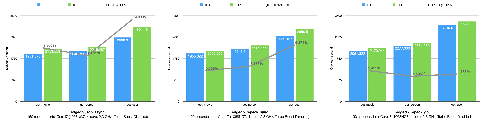

TLS and ALPN
============

This RFC proposes to change the transport of EdgeDB frontend connections to TLS,
and use ALPN for multiplexing protocol selection.


Motivation
----------

The Transport Layer Security (TLS) Protocol is widely used for providing privacy
and data integrity between two communicating applications [1]_. EdgeDB as a
database should naturally support TLS as the transport layer protocol.

With the help of EdgeDB tooling, it will be easy to setup TLS certificates for
both development and production environments. Given also that the benchmark
result of EdgeDB throughput overhead comparing TLS to vanilla TCP is about
5% ~ 15%, it is also proposed to communicate in TLS by default.



At last, with TLS enabled by default, it is possible to leverage the TLS
Application-Layer Protocol Negotiation (ALPN) Extension [2]_ for secure and
reliable protocol selection on top of the TLS transport, allowing EdgeDB to
multiplex different frontend protocols like the binary protocol, EdgeQL over
HTTP or GraphQL over HTTP (and maybe more in the futre) on the same port as
recommended in Pre-RFC 1910 [3]_.


Overview
--------

EdgeDB server CLI (``edb server``) will take a few more parameters to configure
a proper TLS server::

    --tls-certfile
    --tls-keyfile
    --tls-private-key-password
    --tls-protocol-min
    --tls-protocol-max
    --tls-ciphers

The end user is not usually supposed to interact with this API directly, so we
need to bring this to a higher user-level interface with convenience in mind.
We shall discuss about that later in this RFC.

The EdgeDB TLS server will by default advertise all protocols supported by the
server using the ALPN Extension during TLS handshakes. However the way we
advertise them is still pending for discussion. Protocols we have now:

* The EdgeDB binary protocol

* HTTP protocol, on top of which we have:

  * System API starting with ``/server```

  * Extensions that may differ from databases, starting with ``/db``:

    * EdgeQL over HTTP

    * GraphQL over HTTP

    * "Notebook" - parameterless EdgeQL in HTTP-posted JSON

All EdgeDB client bindings should use TLS to talk to an EdgeDB server.
If possible, the client should also join the ALPN negotiation to choose its
preferred protocol for each connection. The ALPN support in target languages:

* Python [4]_: ``set_alpn_protocols()`` and ``selected_alpn_protocol()``
* Go [5]_: ``SupportedProtos`` and ``NegotiatedProtocol``
* Node.js [6]_: ``ALPNProtocols`` and ``alpnProtocol``

If a specific protocol was successfully negotiated, that protocol will be used
as the exclusive one throughout the lifetime of the connection. Or else if the
ALPN agreement was not made, depending on the discussion below we will fallback
to either the EdgeDB binary protocol or the current HTTP protocol.


Development of EdgeDB
---------------------

As mentioned in the Overview, the ``edb server`` CLI will take extra parameters
for TLS. We will use the Python builtin TLS support to handle the certificates
and ALPN, and use the TLS transport implementation in uvloop for the network.

The server-side ``ssl.SSLContext`` [4]_ will be initialized with the default
``protocol=ssl.PROTOCOL_TLS``, leaving the control of accepted TLS protocol
versions to ``SSLContext.minimum_version`` and ``SSLContext.maximum_version``,
which in turn are managed by:

* ``--tls-protocol-min``: One of ``1.0`` (default), ``1.1`` and ``1.2``
* ``--tls-protocol-max``: One of ``1.0``, ``1.1``, ``1.2`` (default) and ``1.3``

SSLv2 and SSLv3 are not supported. TLSv1.3 support is included (question:
shall/can we deliver with OpenSSL >= 1.1.1 consistently for all platforms?).

``--tls-certfile``, ``--tls-keyfile`` and ``--tls-private-key-password`` are
directly the parameters of Python ``ssl.SSLContext.load_cert_chain()``,
except that the password cannot be a function. Instead, the EdgeDB server would
accept password as an environment variable ``EDGEDB_TLS_PRIVATE_KEY_PASSWORD``.

If specified, ``--tls-ciphers`` will be used to call
``ssl.SSLContext.set_ciphers()``.

We'll discuss later in Core EdgeDB Development for the case of omitting ``tls``
parameters.


CLI Tooling
-----------

For the ``edgedb`` CLI, the goal is to make TLS in EdgeDB easy to use. There
are 2 major scenarios:

1. Using EdgeDB with TLS in development process.
2. Deploy EdgeDB with TLS for production environment.

As we'd like to enable TLS by default, a certificate is always required before
starting an EdgeDB instance. In brief, for development, a self-signed
certificate is usually sufficient, so the CLI tooling should have an option to
automatically generate that for the user transparently. For production, we'd
also like to make the certificate/key management easier and safe, options are
discussed later.


Internals
^^^^^^^^^

Under the neath, we'll have new files and folders in the EdgeDB well-known
folder::

    $WELLKNOWN/
        +--config/
        |    +--instance_ports.json
        |    +--tls.json              <NEW>
        |--credentials/
        |    +--<instance>.json       <UPDATED>
        |--certs/                     <NEW>
        |    +--<instance>.cert.pem   <NEW>
        |    +--<instance>.key.pem    <NEW>
        ...

The ``config/tls.json`` contains optional TLS settings for each instance::

    {
        "<instance>": {
            "protocol_min": "<min TLS version>",
            "protocol_max": "<max TLS version>",
            "ciphers": "<available ciphers>"
        },
        ...
    }

If an instance has no record in ``config/tls.json``, the EdgeDB server options
``--tls-protocol-min``, ``--tls-protocol-max`` and ``--tls-ciphers`` will be
omitted and the default value will be used.

``credentials/<instance>.json`` is updated to include the passphrase for the
private key file, if any. For example::

    {
        "port": 10732,
        "user": "edgedb",
        "password": "....",
        "database": "edgedb",
        "tls_private_key_password": "...."
    }

Question: I don't feel comfortable storing the key passphrase here in clear
text, especially if this is in production environment and we asked the user
for passphrase but stored in this file. Perhaps we could use this JSON value
only for the development process, and introduce a more secure (thus less
convenient) way to obtain the private key password, like a customizable command
as in PostgreSQL?

Under the new folder ``certs/``, we'll place all certificates and keys used by
the EdgeDB instances. The cert files will be named after the instance names.
For development scenario we'll likely generate those certs for the user, while
in production we'll "import" the certs specified by the user, by copying and
renaming the cert and key files to the ``certs/`` folder.


Development Scenario
^^^^^^^^^^^^^^^^^^^^

From the user's perspective, ``edgedb server init`` (without parameters we are
introducing in this RFC later) will now automatically generate a self-signed
certificate with a random key passphrase, and set the above config properly.
This is considered to be the development scenario, so we try not to let the
user do extra work here - the ``edgedb server init`` command shouldn't ask
questions about generating the self-signed certificate. Instead, it should warn
about the self-signed certificate, and provide suggestions for production.

Question: because the certificate is self-signed, certificate verification on
the client side would fail. Now that we know we are "in development mode"
(using self-signed certificate), we could leverage the tooling to trust the
certificate on the client side, by adding a boolean flag in
``$WELLKNOWN/credentials/<instance>.json``. We could update our client bindings
and the CLI to honor this flag, load and trust the certificate so that the user
doesn't have to write extra code in development. Though, this works only for
local clients - remote clients don't have access to the local file system so
there has to be a different way for them to trust the dev server. If this
option is good, I will expand ths paragraph with details. Alternatives:

1. Automatically build a local CA, and issue certificates from that CA. The
   clients and CLI will only need to trust the CA certificate. This doesn't
   solve the remote client trouble though.
2. Provide a client-side switch that the user could easily set, so that the
   user could explicitly turn it on for development mode, and off for
   production.


Production Scenario
^^^^^^^^^^^^^^^^^^^

Question: do we want to manage the certificate for the user? That means to
import the user certificate files and store locally, warn about expiry or even
run certbot to renew some free certs (this might be too much). If yes, the
following in this section is just one of the options.

``edgedb server init`` will have additional parameters to import the TLS
certificate and key files for the new EdgeDB instance::

    --import-tls-certfile
    --import-tls-keyfile
    --tls-private-key-password

Again the password option here yields a security concern as mentioned
previously. We should probably follow the way PostgreSQL used to make it a
customizable command to obtain the passphrase.

For simplicity, optional TLS settings are not provided on ``server init``.
These options will also be added to ``edgedb project init`` command.

In addition, we should provide a new ``edgedb server update-tls`` command for
the user to renew the certificate or tweak optional TLS settings. For example::

    --import-tls-certfile
    --import-tls-keyfile
    --set-private-key-password
    --set-protocol-min
    --set-protocol-max
    --set-ciphers
    --generate-dev-cert


ALPN and Protocol Changes
-------------------------

This chapter is about the implementation detail of how to use ALPN and what is
changed in the protocol. I have 2 options:


Option 1: Only ``binary`` and ``http``
^^^^^^^^^^^^^^^^^^^^^^^^^^^^^^^^^^^^^^

The server advertises only two ALPN protocols: ``edgedb-binary`` and ``http``,
where ``edgedb-binary`` is the EdgeDB binary protocol, and ``http`` includes
all the other HTTP-based protocols. As the current code base is already serving
different protocols like EdgeQL and GraphQL over HTTP by different URL path
prefix on the same HTTP port, Option 1 here has the minimum effort to change.

The client should choose between ``edgedb-binary`` and ``http`` based on the
scenario the user is using the client. If the client didn't join the protocol
negotiation, the server will fallback to ``http`` - it is literally just HTTPS.

There will be no protocol change, as we're only adding an mandatory TLS, and
replacing the magic first byte check with ALPN.


Option 2: Fine-grained Protocols
^^^^^^^^^^^^^^^^^^^^^^^^^^^^^^^^

All protocols/extensions are given a unique ALPN protocol name, so that the URI
can be largely simplified. Other than that, the actual protocols remain
unchanged. The server will advertise all ALPN protocols for simplicity, even
though some extension may never be configured on any database.

If for some reason the ALPN negotiation didn't work, the server will fallback
to the current HTTP protocol with all the prefixes for different protocols or
extensions. Alternatively, we could fallback to the binary protocol, so that we
don't have to maintain 2 sets of URI structures.

+-------------------+----------------------------+------------------------------------+------------------------------------+
| Protocol Name     | Description                | Example URI                        | Equivalent URI in old server       |
+===================+============================+====================================+====================================+
| ``edgedb-binary`` | The EdgeDB binary protocol | N/A                                | N/A                                |
+-------------------+----------------------------+------------------------------------+------------------------------------+
| ``system-api``    | Server system API          | ``/status/ready``                  | ``/server/status/ready``           |
+-------------------+----------------------------+------------------------------------+------------------------------------+
| ``edgeql+http``   | EdgeQL over HTTP           | ``/<database>?query=``             | ``/db/<database>/edgeql?query=``   |
+-------------------+----------------------------+------------------------------------+------------------------------------+
| ``graphql``       | GraphQL over HTTP          | ``/<database>/explore``            | ``/db/<database>/graphql/explore`` |
+-------------------+----------------------------+------------------------------------+------------------------------------+
| ``notebook``      | The Notebook extension     | ``/<database>/status``             | ``/db/<database>/notebook/status`` |
+-------------------+----------------------------+------------------------------------+------------------------------------+
| <default>         | No ALPN protocol match     | ``/server/status/ready``           |                                    |
|                   |                            |                                    |                                    |
|                   |                            | ``/db/<database>/edgeql?query=``   |                                    |
|                   |                            |                                    |                                    |
|                   |                            | ``/db/<database>/graphql/explore`` |                                    |
|                   |                            |                                    |                                    |
|                   |                            | ``/db/<database>/notebook/status`` |                                    |
+-------------------+----------------------------+------------------------------------+------------------------------------+

On the client side for either Option, the bindings or the CLI should provide an
ALPN protocol based on the scenario. In most cases, the client binding should
use ``edgedb-binary``


Client Bindings & REPL
----------------------

The official client bindings for Python, Go and Node.js, as well as the EdgeDB
CLI (the REPL and any command connecting to the server) will use TLS to talk to
the EdgeDB instances by default. They should advertise the expected ALPN
protocol in the TLS handshake, and be ready to handle any negotiation result,
depending on the conclusion we'll make for previous questions.

For compatibility considerations, the client is recommended to provide a
temporary option to connect to old EdgeDB servers without TLS. However, this
option should come with a warning and should not be default.

For certificate verification, this was discussed previously. To recap, in order
to make the client code simple and consistent, the client should either check
the well-known EdgeDB location for the flag of self-signed certificate in order
to trust the certificate, or discover the local CA and trust the CA certificate.
The alternative is to enforce the user to explicitly turn on a switch to allow
self-signed certificates, but this depends on the result of the discussion.


Compatibility & Development
---------------------------

We mentioned that the new client is recommended to have an option (with
warnings) to connect to old EdgeDB servers without TLS. In the other hand, we
won't allow old EdgeDB clients connecting to newer EdgeDB servers with TLS
enabled. On a TLS handshake failure, the EdgeDB server will return a error in
clear text, indicating that the client must be upgraded to use TLS.

However, the core EdgeDB server (``edb server``) will provide a hidden option
``--no-tls`` to run the server in non-TLS compatible mode for development and
testing only. This option is not available in the EdgeDB CLI
(``edgedb server``). Without ALPN, the server protocol for ``--no-tls`` will be
exactly the same as it is now, which is the "<default>" HTTP protocol in the
previous table, plus the first magic-byte check for the binary protocol.

Note: if we decided to drop the 2 different sets of URI structures, we shouldn't
add the ``--no-tls`` option too.

Temporarily, the EdgeDB server test suite could run on servers with
``--no-tls``. But eventually the test suite must match how the server is most
commonly used, that will be with TLS. So the proposal was to add a new
subcommand ``edb gen-certs`` to generate self-signed certificate for local
development and running tests::

    edb gen-certs

    Generate (and update) self-signed certificate for development and testing.

        -D, --data-dir  path to the EdgeDB data directory where the generated
                        certificate and key files will be stored

But this doesn't work for ``edb server --temp-dir`` or temporary servers
started in the test suite. Therefore the new proposal is to just generate new
self-signed certificate while the server is starting in devmode or testmode if
no exising certificate is found or given. For that, we'd need either the
OpenSSL library as a new development dependency, or do it through a Rust
extension. On the client side, a global environment variable
``EDGEDB_INSECURE=1`` to skip certificate verification would be neat for
development and running tests - this would need changes in at least the Python
client binding as well as the ``edgedb`` CLI.


.. [1] https://datatracker.ietf.org/doc/html/rfc5246
.. [2] https://datatracker.ietf.org/doc/html/rfc7301
.. [3] https://github.com/edgedb/edgedb/discussions/1910
.. [4] https://docs.python.org/3/library/ssl.html
.. [5] https://golang.org/pkg/crypto/tls/
.. [6] https://nodejs.org/api/tls.html
